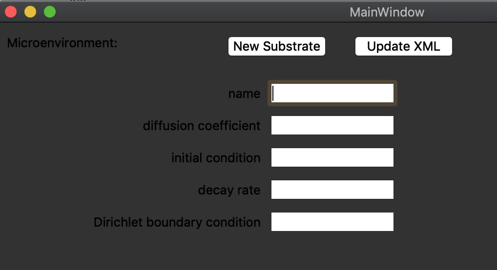

# xml_creator

## Dependencies
Qt5

## Compile and run:
```
$ qmake --version
QMake version 3.1
Using Qt version 5.9.7 in /Users/heiland/anaconda3/lib

$ qmake
$ make
$ ./qt_widget_app1
or,
$ open qt_widget_app1.app  # on macOS
```

