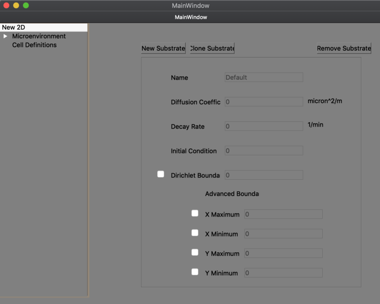

# xml_creator - create/edit a PhysiCell configuration (XML) file

## Qt for Python approach

- instructions forthcoming for installing an appropriate distribution of Python for your operating system and the `pyside` module

```
$ cd qt_for_python/gui4xml
$ python gui4xml.py
```

---
## C++ Qt approach

```
-- Installed Anaconda Python 3.x distro which includes some Qt stuff

~/dev/xml_creator$ cd Microenvironment
~/dev/xml_creator/Microenvironment$ which qmake
/Users/heiland/anaconda3/bin/qmake
~/dev/xml_creator/Microenvironment$ qmake --version
QMake version 3.1
Using Qt version 5.9.7 in /Users/heiland/anaconda3/lib
~/dev/xml_creator/Microenvironment$ qmake
~/dev/xml_creator/Microenvironment$ make
...
on a Mac:
~/dev/xml_creator/Microenvironment$ open MicroenvironmentGUI.app/
```


